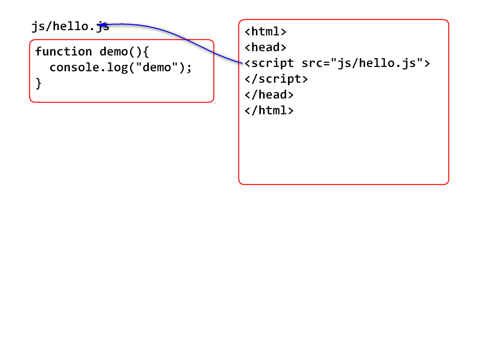
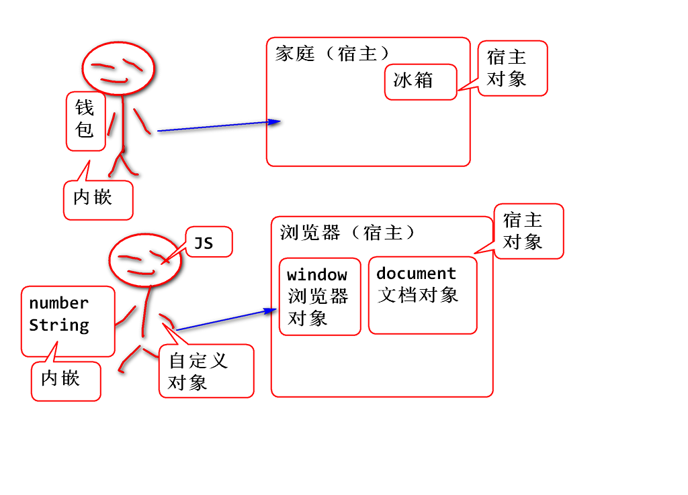

# JavaScript（JS）

- HTML： 组织内容
- CSS： 显示效果
- JavaScript: 页面中的动作效果

## Java 和 JavaScript

Java和JavaScript只有4个字母一样！没有任何关系的两个语言！

历史上 网景 公司推出脚本语言时候，为了蹭当时Java语言的热度，故意起名为JavaScript。

JavaScript的API方法仿照了部分Java API设计。

目前JavaScript是俗称，其官方标准名称 ES Script。

## 什么是Java Script

JavaScript是运行在浏览器中的脚本语言。 被浏览器事件驱动，可以访问浏览器提供了对象，在浏览器中编程控制浏览器中显示的页面效果。

> JS 可以在Node.js 环境中执行， 是服务端的JS

> 脚本语言: 没有编译器，直接解释执行的语言称为脚本语言。

## JavaScript Hello World！

1. HTML
2. 在网页中添加JS代码，处理事件
3. 在浏览器中显示HTML
4. 利用事件触发执行JS

案例：

	<html>
		<head>
		</head>
		<body>
			
测试信息

		</body>
	</html>

## JS 有3种嵌入方式

1. 内联式： 直接写到HTML标签事件中，不推荐使用。 JS脚本和HTML混合，不利于软件的开发和维护。
2. 内部式： 使用 Script 标签声明，JS脚本在当前HTML有效。
3. 外部式： 使用 Script 标签引入js文件，用于多个HTML文件共享一个JS脚本文件。

内部式JS 案例：

	<!DOCTYPE html>
	<html>
	<head>
	<meta charset="UTF-8">
	<title>Insert title here</title>
	
	</head>
	<body>
		<h1>内部式JS</h1>
		
演示
 
	</body>
	</html>	

外部式：

案例：
	
1. 编写JS文件 js/hello.js：
 
		function demo(){
			console.log("demo");
		}

2. 编写测试页面 jsdemo02.html

		<!DOCTYPE html>
		<html>
		<head>
		<meta charset="UTF-8">
		<title>Insert title here</title>
		<!-- script 只能单独加载外部JS脚本，
		不能在加载JS脚本的同时在内部声明JS脚本 -->
		
			
		
		</head>
		<body>
			<h1>内部式JS</h1>
			
演示
 
			<h1>外部式JS</h1>
			
演示外部式JS

		</body>
		</html>

## JS 中声明变量

语法：

	var 变量名; 

JS 的变量的语法很“自由”

1. 可以不声明使用！
2. 建议声明变量再使用，声明时候使用var。
3. JS变量没有明确类型，赋值啥类型就是啥类型。
	- 甚至可以改变类型赋值。
4. 如果不初始化直接使用，其值是“未定义”。

> JS 有两种实验方式： Console实验，JS脚本实验

案例：

	<!DOCTYPE html>
	<html>
	<head>
	<meta charset="UTF-8">
	<title>Insert title here</title>
	
	</head>
	<body>
		<h1>测试变量的声明</h1>
		
测试
 
	</body>
	</html>

## 检查变量中数据的类型

JS 中使用typeof()函数检查变量引用的数据的类型

案例:

	<html>
	<head>
	<meta charset="UTF-8">
	<title>Insert title here</title>
	
	</head>
	<body>
		<h1>测试变量引用数据的类型</h1>
		
测试

	</body>
	</html>

## JS 中的数据类型

1. JS 中数据都是对象，对象分为几种
	- JS内嵌对象，也称为JS的内置对象， 或者JS的基本类型
		- number  string
	- 由“宿主”环境提供的对象
		- window document
	- 自定义对象
		- 使用JS语法创建的对象
2. 特殊值，特殊值用于表示没有变量没有引对象的情况
	- null
	- 未定义

## JS 内置对象

JS 内置对象，是JS本身内置的对象。 也称为JS的基本数据类型，与Java不同这些类型是对象！

### number 

JS中是对象，是浮点数，计算结果是浮点结果。 没有整数！！

直接赋值为数的，都是number类型。 包含number类型方法。

number类型包含方法：

- num.toFixed(2) 将num转换为字符串，保留两位小数。

其它方法请参考对应的手册： [http://doc.tedu.cn/w3/jsref/jsref_obj_number.html](http://doc.tedu.cn/w3/jsref/jsref_obj_number.html)

### string

任何JS字符串都是string类型。 JS string类型包含的API方法与Java String的方法类似。

具体请参考： [http://doc.tedu.cn/w3/jsref/jsref_obj_string.html](http://doc.tedu.cn/w3/jsref/jsref_obj_string.html)

案例：

	<!DOCTYPE html>
	<html>
	<head>
	<meta charset="UTF-8">
	<title>Insert title here</title>
	
	</head>
	<body>
		<h1>Number 和 String</h1>
		
测试

		<h1>页面局部刷新</h1>
		
red

		
Test

	</body>
	</html>

### boolean

Boolean 只有两个值 true, false

### Date 

Date 类型用于表示时间，其中封装了时间毫秒数。

最重要方法： 

- toLocaleString() 返回当前系统的时间字符串。
- getTime() 返回时间毫秒数

案例：

	<!DOCTYPE html>
	<html>
	<head>
	<meta charset="UTF-8">
	<title>Insert title here</title>
	
	</head>
	<body>
		<h1>Date类型</h1>
		
测试
	
		
	</body>
	</html>
	
### Array 

数组，JS中的数组与Java中的ArrayList基本一样，是长度可变的数据结构。 一个数组中可以存储多种数据类型的元素。

1. 声明数组：

		var arr = [];
		var ary = [1,2,3,4];

2. 向数组追加元素：

		arr.push(2,5);
		arr[arr.length] = 8;

3. 向数组前面插入元素：

		arr.unshift(8);

4. 删除元素

		arr.splice(2,2);//从位置2开始连续删除两个元素。

测试案例：

	<!DOCTYPE html>
	<html>
	<head>
	<meta charset="UTF-8">
	<title>Insert title here</title>
	
	</head>
	<body>
		<h1>Array测试</h1>
		
test
 
	</body>
	</html>

### 特殊值

null： 表示变量没有引用任何对象。 

undefined：变量声明以后，还没有初始化之前的不确定情况！

无论是 null 还是 undefined 都表示有变量，无对象，此时调用属性或者方法将出现"错误"

> 编程时候，表示“没有” 一般使用 null。

## 自动类型转换（隐式类型转换）

JS 发明之初是为了美工使用，就是为了方便使用。

1. 数字自动转换为字符串；

		var a1 = 56;
		var a2 = "66";
		console.log(a1+a2); //"5666"

2. boolean 类型自动转换为数字，true 为 1， false 为 0
	
		var a1 = 56;
		var b1 = true;
		var b2 = false;
		console.log(a1+b1);//57
		console.log(a1*b2);//0

3. 0, ""， null，undefined，NaN 自动作为 false，反之为true

		var n;
		if(n){
			console.log("true");
		}else{
			console.log("false");
		}

4. 数字与 undefined 运算时候结果是 NaN
	- NaN: Not a Number, 不是一个数！

案例：

	<!DOCTYPE html>
	<html>
	<head>
	<meta charset="UTF-8">
	<title>Insert title here</title>
	
	</head>
	<body>
		<h1>特殊值作为false使用</h1>
		
测试

		<h1>非"空"作为 true 使用</h1>
		
测试

	</body>
	</html>

NaN案例：

	<!DOCTYPE html>
	<html>
	<head>
	<meta charset="UTF-8">
	<title>Insert title here</title>
	
	</head>
	<body>
		<h1>NaN现象</h1>
		
Test

	</body>
	</html>

### 运算符

运算符与 Java 基本相同。

1. JS中没有整数，除法是浮点除法，不整除。 利用parseInt函数实现取整数
	
		7/2 得 3.5
		parseInt(7/2) 得到 3

2. == 不区别数据类型判断相等， === 称为“全等” 数据类型一样，数值一样

		var a = 55;
		var b = 55;
		var c = '55';
		console.log(a==b); //true
		console.log(a==c); //true
		console.log(a===b);//true
		console.log(a===c);//false

3. != 和 !== 自行实验

练习：

1. 利用Math.random() 生成一个1~100之间的随机数。作为半径计算圆面积。在页面的 span 元素中显示出来。 
	- 要求： 在控制台和HTML文件两种方式实现。
2. 编写案例，实验全部的知识点。
3. 创建一个数组，添加一组数据，找出其中最大的数据。
	- 提示：JS 的for循环与Java一样
4. 创建一个数组对数组元素进行冒泡排序。

	

